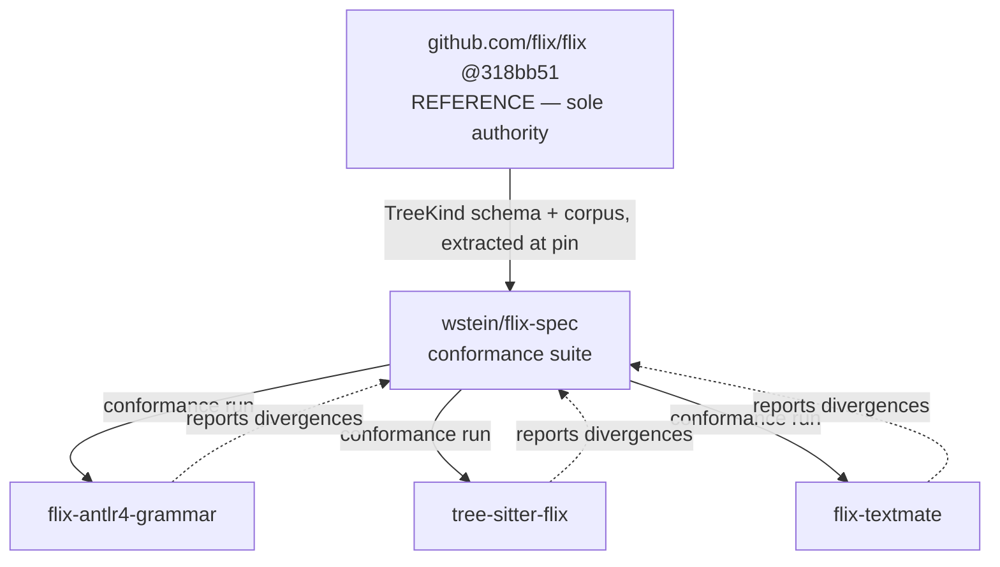

# Review: `wstein/flix-spec` implementation plan

Reviewing `tmp/implementation_plan.md` — a proposal to create a standalone repository
`wstein/flix-spec` as "the central source of truth for language semantics, formal syntax
specifications, test fixtures, and AST mapping schemas", consumed as a git submodule by
`flix-antlr4-grammar`, `flix-fork`, `tree-sitter-flix`, and `flix-textmate`.

Same room as `SPEC-AS-CODE-DEBATE.md`, held immediately after it. Ratings **1–5**
(5 = adopt, 1 = reject).

**Status checked before review**: `github.com/wstein/flix-spec` exists, is public, and is
**empty** (`isEmpty: true`, created 2026-08-01T18:10Z). Nothing has been built. This review is
therefore cheap to act on, which is the best thing about its timing.

---

## What the plan gets right

**Ingrid** insists on starting here, because two of these are genuinely good and will survive
the demolition.

1. **Fixtures do not belong to the ANTLR customer.** Right now `fixtures/` lives in this repo
   and is shaped by it — `fixtures/snapshots/*.snap` are ANTLR `toStringTree` output, unusable
   by anyone else. A conformance suite that four parsers can all be measured against is a real
   artifact that does not currently exist anywhere. **Rated 5 as an idea.**
2. **A shared AST/TreeKind schema is exactly the missing piece we identified an hour ago.**
   `SPEC-AS-CODE-DEBATE.md` P3 asked for `TREEKIND-MAP.md` to stop being 62 hand-written lines
   nothing reads and become executable input to a differential harness. The plan's `spec/ast/`
   is the same instinct. **Rated 5 as an idea.**
3. **The diagnosis is correct.** "Rather than … scattering grammar specs across multiple tooling
   repositories" — yes. Four repos currently re-derive the same facts by hand, and this session
   found a live defect (D12) caused by exactly that.

**Dana**: "Agreed on all three, and I want that on the record before I say the rest, because the
rest is unanimous rejection of the architecture. The instinct is right. The arrows are wrong."

---

## Objection 1 — the authority arrow is inverted (fatal)

**Dana**: "Look at consumer #4. *'`flix-fork` (Reference Compiler) — Cross-verify `Parser2.scala`
and `Weeder2.scala` against `fixtures/` and snapshot AST baselines.'* The plan makes the
reference compiler a **consumer** of our spec repo. That is backwards in the strongest possible
sense. `Parser2.scala` does not need to be verified against us. We need to be verified against
`Parser2.scala`. It defines the language; we describe it."

**Sven**: "This is the failure I predicted in the previous session and I did not expect to see it
committed to a diagram within the hour. A specification that the implementation is required to
conform to has authority only if it was *agreed* — standardised, or at minimum accepted upstream
by the Flix project. `wstein/flix-spec` is a personal repository created twenty minutes ago. It
has no such standing. Declaring it the source of truth does not make it one; it just moves where
the unverified assertions live."

**Mo**: "And it is worse than neutral. Today, `flix-antlr4-grammar` at least *knows* it is
downstream — `CLAUDE.md` says 'Follow the lexer, not the docs' and names `Parser2.scala` as
authority. This plan would replace a correct dependency with an incorrect one and call it
progress."

**Priya**, sharper: "Note the second half. The plan names **`flix-fork`**, not
`github.com/flix/flix`. Upstream Flix appears nowhere in the diagram or the integration
strategy. The policy stated in this project an hour ago is that the oracle is
`github.com/flix/flix`, never a fork. This plan doesn't merely fail that test — it doesn't
contain the upstream repository at all. Every arrow in the diagram terminates in something we
own."

**Rafael**: "So the whole graph is closed. Four repos we control, one spec repo we control, and
a web publish. Nothing in it can ever tell us we are wrong about Flix."

**Verdict on Objection 1**: **fatal as drawn**. Rated **1** by all six.

---

## Objection 2 — it ships the same defect we just found, scaled by four

**Ingrid**: "The plan lists `tools/validate.mjs` — one file, described as 'Validation and doc
generator toolchain'. That is the entire conformance mechanism for a repository claiming to be
the source of truth for a programming language. What does it validate *against*?"

**Priya**: "Nothing is specified. And we know exactly what that produces, because this repo is
the experiment. `flix-antlr4-grammar` has a 95.81% parse-rate gate, 49 tests, CI doc-drift
checking, and a hand-written `TREEKIND-MAP.md`. It also has **1,243 expression-position `qname`
nodes whose shape contradicts `Parser2.scala`**, undetected, because every gate asks 'did
something match?' and none asks 'did the right thing match?'."

**Sven**: "So the proposal is to take a repository with a missing oracle and make it the
authority for three more repositories. The defect does not get diluted by fan-out. It gets
republished."

**Dana**: "Order of operations. Build the oracle first, in the one place we can already measure
it. If the differential harness against `Parser2.scala`'s `SyntaxTree` runs and holds at zero
disagreements, *then* the shape it converged on is worth extracting into a shared repo — because
it will have been proven against something. Extracting it now means extracting an unvalidated
guess and giving it a URL."

**Verdict**: **sequencing is inverted**. Mechanism before distribution, not after.

---

## Objection 3 — `spec/semantics/` is the proposal this room rejected an hour ago

**Sven**, who proposed it and lost: "`spec/semantics/` — 'Type & effect system invariants,
Datalog fixpoint specs'. That is P10 from the previous session. I argued for it. I was rated 1,
1, 2, 2, 1, 3 and I accepted the outcome, because Dana's objection was correct: Flix's effect
system is Boolean-unification-based, with region inference, trait resolution, and lattice-valued
Datalog fixpoints. Formalising that is a multi-year research programme, and it would not have
caught the syntactic defect that is actually live in the grammar."

**Dana**: "One directory line in a layout diagram is where multi-year efforts go to become
'someone will fill this in'. Delete it. If it is ever attempted it deserves its own proposal
with its own justification, not a bullet in a tree listing."

**Rating on `spec/semantics/`: 1.** Cut it entirely.

---

## Objection 4 — three mechanical claims that do not hold

**Mo** takes these, having built two of the four consumers.

**(a) "Consume `spec/grammar/` EBNF rules to generate Tree-sitter grammar rules (`grammar.js`)."**

"You cannot mechanically derive a working tree-sitter grammar from implementation-agnostic EBNF.
`tree-sitter-flix` carries **22 declared `conflicts:` entries** — eight of them
pattern-versus-expression. Those are not in any EBNF. They are LR-specific resolution
directives, plus precedence annotations, plus the `token()`/`prec.dynamic()` choices that make
generation terminate in seconds rather than minutes. `CLAUDE.md` records that Datalog took
tree-sitter generation from 16 s to 7–11 minutes. An EBNF-to-`grammar.js` generator produces a
file that either fails to generate or generates a different language. **Rated 1.**"

**(b) "`flix-textmate` — derive keyword lexicon and token rules from `spec/grammar/` lexer tables."**

"This is a *downgrade*, and it is the one that annoys me most. `flix-textmate`'s lexicon is
currently **machine-extracted from the Flix compiler**. That is better provenance than anything
`flix-spec` could offer, because it is derived from the authority rather than from a
transcription of it. The plan proposes replacing a compiler-extracted table with a
human-maintained one. And we have the receipt: `fixtures/keywords.txt` in this repo is
hand-transcribed from `Lexer.scala:49-139`, and `DEFECTS.md` D1/D2 record that the first attempt
got **22 keywords missing and 24 phantom keywords wrong**. That is what hand-transcription buys.
**Rated 1.**"

**(c) "`snapshots/` — Canonical CST & AST S-expression snapshots."**

"Shared across four parsers. There is no canonical CST. This repo's snapshots are ANTLR
`toStringTree(parser)` output keyed by *ANTLR rule names*; tree-sitter's are keyed by
tree-sitter node names; TextMate has no tree at all. To share snapshots you first need a
canonical tree format that all consumers can project into — which is the entire hard problem,
is undefined in the plan, and is listed as a directory. **Rated 2** — the goal is right, the
plan treats the hard part as a folder."

**Ingrid** adds: "Also 'implementation-agnostic EBNF' in `spec/grammar/` is doing enormous
unacknowledged work. Flix's lexer is not expressible in EBNF: `->` and `.` are
whitespace-sensitive, operator lexing is maximal-run-then-exact-match rather than longest-prefix,
`!` and `$` are name characters, and string interpolation needs a mode stack plus a per-level
brace counter. Those are in `FlixLexerBase.java` as hand-written code precisely because no
grammar formalism expresses them. An EBNF that omits them is not implementation-agnostic; it is
wrong."

---

## Objection 5 — git submodules, and the diamond

**Rafael**: "Practical. `flix-antlr4-grammar` already declares `grammars/` as 'Shared canonical
ANTLR4 grammars consumed by both customers'. The plan proposes mounting the submodule at
'`spec/` or `grammars/`'. Mounting at `grammars/` collides with the existing canonical
directory; mounting at `spec/` means the ANTLR grammar and the 'canonical ANTLR spec' are two
different files in two different repos with no mechanism keeping them equal. You have created
the drift problem you set out to solve, and given it a network boundary."

**Priya**: "Submodules also break the corpus gate's reproducibility story. We just agreed to pin
the oracle by SHA and verify by tree hash. Adding a floating submodule pointer to four
downstream CI configurations, each updating on its own schedule, is four more places for the
'which revision was this measured against?' question to have no answer."

**Rating on submodule distribution: 2.** Publish a versioned package or vendor the file; do not
add a submodule.

---

## Ratings

| # | Element of the plan | Dana | Rafael | Ingrid | Mo | Priya | Sven | Consensus |
| --- | --- | --- | --- | --- | --- | --- | --- | --- |
| A | `flix-spec` as **source of truth**, reference compiler as consumer | 1 | 1 | 1 | 1 | 1 | 1 | **Reject.** Inverts authority. |
| B | Upstream `github.com/flix/flix` absent from the architecture | 1 | 1 | 1 | 1 | 1 | 1 | **Reject.** Closed graph; unfalsifiable. |
| C | Shared **conformance fixture suite** (positive/negative) | 4 | 5 | 5 | 5 | 5 | 4 | **Adopt**, re-scoped — see counter-proposal. |
| D | Shared **AST / TreeKind schema** (`spec/ast/`) | 5 | 4 | 5 | 5 | 5 | 5 | **Adopt**, and it is the highest-value part. |
| E | `spec/semantics/` (type/effect/Datalog) | 1 | 1 | 2 | 1 | 1 | 2 | **Cut.** Re-litigation of P10. |
| F | `spec/grammar/` implementation-agnostic EBNF | 2 | 2 | 1 | 2 | 2 | 3 | **Reject as specified.** Flix's lexer is not EBNF-expressible. |
| G | Generate tree-sitter `grammar.js` from EBNF | 1 | 2 | 1 | 1 | 2 | 2 | **Reject.** Ignores 22 LR conflicts. |
| H | Derive `flix-textmate` lexicon from `flix-spec` | 1 | 2 | 1 | 1 | 1 | 2 | **Reject.** Downgrades compiler-extracted provenance. |
| I | Shared CST/AST snapshots | 2 | 2 | 2 | 2 | 3 | 3 | **Defer.** Needs a canonical tree format first (= D). |
| J | Git submodule distribution | 2 | 2 | 2 | 3 | 1 | 2 | **Reject.** Versioned package or vendoring. |
| K | `tools/validate.mjs` as the conformance mechanism | 1 | 2 | 1 | 2 | 1 | 1 | **Reject.** Undefined oracle. |
| L | Building it **now**, before the differential harness exists | 1 | 1 | 1 | 1 | 1 | 1 | **Reject.** Sequencing inverted. |
| M | CI publish to `flix.dev` | 2 | 3 | 2 | 2 | 2 | 2 | **Out of scope.** Not ours to publish to. |

---

## Counter-proposal

**Dana** summarises what the room would approve instead.

> Keep the repository. Change what it is, what it points at, and when it gets built.
>
> `wstein/flix-spec` is not a specification of Flix. It is a **conformance suite** for tools that
> parse Flix, and its authority comes entirely from being measured against
> `github.com/flix/flix`. Say that in the README's first sentence.

**Revised responsibilities** — three things, all mechanically checkable:

| Directory | Contents | Authority |
| --- | --- | --- |
| `corpus/` | The pinned upstream SHA and tree hash, plus the harness that fetches it. Not a copy of the corpus. | `github.com/flix/flix@318bb51`, tree `294b9ac53…` |
| `ast/` | The canonical node schema: Flix `TreeKind` names, generated from `SyntaxTree.scala` at the pinned SHA, plus per-consumer projection maps. | Generated, never hand-edited |
| `fixtures/` | Positive and negative snippets with the *expected `TreeKind` shape*, not a parser-specific snapshot. | Produced by running the reference parser |

**Revised arrows** — upstream at the top, every tool a peer, nobody an authority over anyone:



`flix-fork` does not appear. It is not an authority and it is not a consumer.

**Sequencing** — the room was unanimous that this is the part that matters:

1. Land **P1** (the `qname` `tail` fix) in `flix-antlr4-grammar`.
2. Land **P7** (repoint CI at upstream `flix/flix@318bb51`, verify by tree SHA).
3. Build **P2** — the differential harness against `Parser2.scala`'s `SyntaxTree` — *inside*
   `flix-antlr4-grammar`, where it can be debugged against a parser we already understand.
4. Run it to a stable, non-zero-information baseline. Expect ~1,500 disagreements before P1,
   near-zero after.
5. **Only then** extract the harness, the schema, and the fixtures into `flix-spec` — because at
   that point they will have been proven against upstream, and extraction is refactoring rather
   than speculation.
6. Onboard a second consumer (`tree-sitter-flix`) and see whether the schema survives contact
   with a parser that was not its parent. That is the real test of whether the repo deserves to
   exist.

**Priya**: "And leave the repo empty until step 5. An empty repo costs nothing. A scaffolded repo
with a README claiming to be the source of truth for Flix costs credibility the first time
someone reads it and finds `spec/semantics/` empty."

---

## Addendum — the plan has exactly one precedent, and it doesn't transfer

Prior-art research arrived after the review. It matters here more than anywhere, because the
plan's core idea — *one machine-readable source generating the spec, the parsers, and the test
suite* — has been done exactly once, successfully, and the comparison is instructive rather
than dismissive.

**WebAssembly SpecTec** (Youn et al., PACMPL 8/PLDI art. 210, 2024) generates the normative
LaTeX, the prose reST, and the reference interpreter from one DSL. Adopted by the W3C Wasm CG
**32–0** on 11 March 2025; Wasm 3.0 shipped with it on 17 September 2025. It found 23 confirmed
spec bugs. **The plan's vision is real and it works.**

**Sven**: "Credit where it's due — this is the strongest possible version of what the plan is
reaching for, and the junior reached for it independently. Now look at the preconditions, because
none of them hold here.

- Wasm's normative text **already contained a formal semantics** before SpecTec existed. Flix has
  no formal semantics at all.
- SpecTec was built by a group from KAIST, Cambridge, Imperial, Edinburgh and Ljubljana, out of a
  **Dagstuhl seminar**, over **~2.5 years** seminar-to-shipped.
- The tool is **32,969 lines of OCaml** — roughly **3.5× the 9,351-line spec it generates**.
- The plan's equivalent is `tools/validate.mjs`, one file, oracle unspecified.
- Even Wasm's loop **is not closed**: the Rocq/Isabelle/Lean prover backends are still on
  branches, and Wasm 2.0 never became a W3C Recommendation."

**Mo**: "And the retrofit record is a graveyard, which is the category this plan is in. JSCert —
~3,000 lines of Coq, scoped to ES5.1, **explicitly did not specify the parser**, last
substantive commit **2016-12-16**, never adopted by TC39. K's `javascript-semantics` last pushed
2016, `java-semantics` 2021, `c-semantics` 2022. Ott's last release is 2024-12-30. Redex has no
releases at all. Every one of these was a better-resourced attempt than a personal repo created
this afternoon."

**Dana**: "The one retrofit that *worked* is the one that gave up on mechanization. Ferrocene's
FLS — the only language spec carrying regulatory force, TÜV SÜD-qualified October 2023,
upstreamed to `rust-lang/fls` in March 2025 — is **hand-written structured prose**, with its
structure borrowed from the Ada Reference Manual. That is the shape of a successful retrofit.
Not `spec/semantics/`."

**Ingrid** adds the measurement the plan should be judged against: "Lämmel & Verhoef define
**L4** as a grammar tested against **millions of lines of code**. Their VS COBOL II recovery hit
~2 M LOC in **two weeks** for **US$25,000**. This plan proposes five directories and four
consumer integrations, and specifies no corpus, no oracle, and no acceptance number. Recovery
work that succeeded was ruthlessly narrow and measured continuously."

**Priya**: "One thing the plan is *not* guilty of, for the record. `antlr/grammars-v4` issue
**#2405** documents grammars whose start rule isn't `EOF`-anchored, so a parse can silently
consume a prefix and be counted a success. I checked ours: `compilationUnit` ends in `EOF`
(`FlixParser.g4:16-18`) and trailing garbage is reported. That trap is one we already avoided."

**The one addition the evidence argues *for*:** Bendrissou, Cadar & Donaldson (TOSEM 34(4):116,
2025) mutate an ANTLR grammar, generate with Grammarinator, and differential-test against a
reference parser in both directions. They found **three bugs in `grammars-v4` itself** and
**CVE-2024-38428**. If `flix-spec` eventually exists, *this* is the thing it should host — a
shared conformance harness — not an EBNF nobody can generate from.

---

## Revision after author clarification

The author clarified two things the review had got wrong, and then settled the two open
decisions. Recording both, because the review above was written under a mistaken reading and
should not be cited without this section.

### What the clarification retires

> "`wstein/flix-spec` is a new one, built from scratch, but some time `flix-antlr4-grammar` will
> benefit and use `wstein/flix-spec` as submodule, similar will `flix-fork`, `flix-textmate`,
> `tree-sitter-flix` do someday."

**Objection 5 and element L are withdrawn.** The review read the four arrows in the plan's
diagram as simultaneous commitments and objected that mechanism must precede distribution.
Adoption is explicitly *"someday"* — staggered, opt-in, per consumer. Greenfield-first is a
legitimate strategy for a shared artifact, and the submodule-collision complaint largely goes
with it, since nothing is being mounted into `grammars/` this week.

**Objection 1 is substantially softened.** A conformance suite that *every* implementation runs,
including the compiler, is not authority inversion — it is **Test262**. V8 and SpiderMonkey both
consume Test262; nobody claims Test262 owns JavaScript. Under that reading, `flix-fork`
appearing as a consumer is ordinary and correct. The review over-read the diagram.

**What survives from Objection 1** is narrower and still real: Test262's expectations trace to a
TC39-authored specification. Flix has no such document, so `flix-spec` cannot manufacture
authority — it has to *derive* it. That was the open question, and it is now answered.

### Decisions taken

**1. Content is derived from upstream `github.com/flix/flix` at a pinned SHA.** Hand-write only
what cannot be extracted. Drift surfaces as a regenerated diff in CI. The accepted cost, stated
plainly so nobody is surprised later: **a derived spec cannot falsify the reference compiler.**
If Flix has a bug, `flix-spec` inherits it. That is the price of the oracle rule, it is the right
trade at this stage, and it should be in the README rather than discovered in year two.

This also settles the disputed items above. `spec/grammar/` as hand-written
"implementation-agnostic EBNF" is out — it was the hand-authored option, and Ingrid's objection
stands regardless (Flix's whitespace-sensitive `->`/`.`, maximal-run operator lexing, `!`/`$` as
name characters, and interpolation mode-stack are not EBNF-expressible). `spec/semantics/` is out
by the same rule: nothing to extract it from.

**2. First commit is the pin plus the AST schema extractor.** Smallest slice that is
mechanically checkable end to end, and it is what unblocks the shape-diff harness.

### Feasibility, measured rather than assumed

A throwaway extractor was run against `SyntaxTree.scala` at `flix/flix@318bb51` during this
session. **~30 lines of JavaScript; 192 `TreeKind`s recovered**, correctly nested:

| Group | Kinds |
| --- | --- |
| `Expr` | 98 |
| `Type` | 24 |
| top-level | 25 |
| `Decl` | 17 |
| `Pattern` | 11 |
| `Predicate` | 11 |
| `UsesOrImports` | 6 |
| **Total** | **192** |

Three observations that fall straight out of that number:

- **`docs/TREEKIND-MAP.md` covers 42 rows against 192 kinds — about 22%.** The hand-written map
  is not merely unverified, it is mostly empty, and nobody could tell because nothing reads it.
- **This grammar has 83 parser rules and 141 alternatives against 192 `TreeKind`s.** The
  correspondence is not 1:1 and never will be, so the shared schema must carry an explicit
  per-consumer *projection*, not a naive rename table. This is the one place the plan's
  `spec/ast/` needs to be more than a JSON dump.
- `Type.Function`, `Expr.InstanceOf` and `TypeParameter` — the three kinds `CLAUDE.md` calls dead
  — are all **present in the enum**. "Dead" means `Parser2` never emits them, which is a claim
  about the parser, not the type. Extraction plus one reachability run over the corpus would
  turn that hand-maintained footnote into a generated fact.

### Toolchain: ANTLR-based Scala parsing, JVM

Direction taken: the extractor must **parse Scala with an ANTLR grammar**, not regex over source
text; scripting in JVM or Node, never Python or Perl. Both parts were tested rather than assumed,
and the testing produced a finding worth the whole detour.

**`scala/scala2/Scala.g4` is unusable, and fails silently.** 1,382 lines, byte-identical to the
vendored copy at `antlr/antlr4/examples/grammars-v4/scala/Scala.g4`. Against
`SyntaxTree.scala` it reports **0 syntax errors** — and recovers **11 of 192 declarations**.
The parse "succeeds" and the tree is garbage: `templateStat`'s `expr` alternative absorbs whole
declaration blocks, and only the tail of the file retains structure. A naive extractor built on
it would have emitted a nearly-empty `treekind.json` with a green exit code.

**This is the session's thesis reproduced a third time, in the tooling this time.** Parse rate
said fine. There was no error to see. Only counting the *shape* — how many declarations came
back — exposed it. Two consequences for `flix-spec`:

1. The extractor must **assert on its own output**, not just on the absence of parse errors.
   A floor (`count >= 190`) and a zero-error check, both fatal. A spec generator that can emit an
   empty spec silently is a spec generator that will.
2. Grammar choice is a load-bearing dependency and belongs in `pin.json` alongside the Flix SHA.

**`scala/scala3/` is the right grammar.** Split `Scala3Lexer.g4` (585) + `Scala3Parser.g4` (948)
with a `Scala3LexerBase` helper class — the same architecture as this project's `FlixLexerBase`.
Its readme states the source EBNF was read **6 May 2026** and, notably: *"I tried to mirror what
the Dotty compiler does rather than assume blind allegiance to a human-scraped EBNF."* That is
this project's own "follow the lexer, not the docs" rule, adopted independently by the grammar's
author. Result on `SyntaxTree.scala`: **0 errors, all 192 TreeKinds**, with `extends` parent,
source line, and `case object`/`case class` form.

Flix is Scala 2.13, so using the Scala 3 grammar is a deliberate choice — it works here because
the file is plain declarations, and it is the maintained one. Worth a comment in the extractor
rather than leaving a future reader to wonder.

**JVM, not Node — decided by evidence.** grammars-v4 ships `Scala3LexerBase` for **C# and Java
only**. A Node extractor would require porting a 532-line lexer base to TypeScript, which is
precisely the blocked work this repo already carries as D11. JVM costs nothing extra: ANTLR's
Java target is the reference implementation and the toolchain is already present.

**Cross-checked.** An independent throwaway extractor written earlier (regex over source, since
discarded) produced the same 192 and the same grouping — `Expr` 98, `Type` 24, top-level 25,
`Decl` 17, `Pattern` 11, `Predicate` 11, `UsesOrImports` 6. Two methods, one answer. The ANTLR
version additionally recovers what the regex version got wrong, e.g. that `DerivationList` sits
at top level but `extends Type` rather than `TreeKind` — a real quirk in Flix's source that a
line-oriented scraper misfiles.

### Agreed first commit

```text
wstein/flix-spec/
├── README.md                       # "derived conformance suite", not "source of truth"
├── LICENSE                         # Apache-2.0, matching flix/flix
├── pin.json                        # flix/flix SHA 318bb51 + tree 294b9ac53…
│                                   # + grammars-v4 SHA for scala/scala3
├── ast/
│   └── treekind.json               # GENERATED — 192 kinds, extends, line, form
├── tools/
│   ├── grammar/                    # vendored scala/scala3 Scala3{Lexer,Parser}.g4
│   │                               #   + Java/Scala3LexerBase.java, at the pinned SHA
│   ├── ExtractTreeKind.java        # ~60 lines; walks TmplDefContext
│   └── build.gradle.kts            # ANTLR 4.13.2, Java target
└── .github/workflows/
    └── verify.yml                  # re-extract at the pin; fail on diff
```

`verify.yml` must fetch `github.com/flix/flix` at the SHA in `pin.json` and check the **tree
hash**, not a file count — the same defect currently live in this repo's `ci.yml`. It must also
fail if the extractor reports any parse error *or* returns fewer than 190 kinds, per the silent
failure documented above.

A working `ExtractTreeKind.java` already exists from this review and produces the 192-entry
`treekind.json`; commit 1 is largely a matter of moving it, pinning the grammar, and wiring CI.

Deliberately absent from commit 1: `spec/grammar/`, `spec/semantics/`, `schemas/`, `fixtures/`,
and every consumer integration. Fixtures come next, once the schema exists to express expected
shapes in. Consumers come when they ask.

---

## Verdict

*(Revised after the author clarification above. The original verdict assumed immediate consumer
fan-out and is superseded.)*

**Build it — as a derived conformance suite, not as a specification of Flix.** The instinct is
correct and two of its components (the conformance fixtures and the AST schema) are things this
project independently concluded it needs, an hour before the plan was written.

Four changes to the plan as written:

1. **Rename the claim.** Not "the central source of truth for language semantics." It is a
   conformance suite whose authority is derived from `github.com/flix/flix` at a pinned SHA.
   First sentence of the README.
2. **Upstream `flix/flix` enters the diagram as the sole authority.** `flix-fork` is not an
   authority and is not special; it is one more consumer, whenever it wants to be.
3. **Cut `spec/grammar/` and `spec/semantics/`.** Nothing to derive them from. The lexer is not
   EBNF-expressible and the semantics is a multi-year research programme, not a directory.
4. **Ship the extractor before the scaffold.** 192 `TreeKind`s came out in ~30 lines during this
   review; an empty `spec/semantics/` directory in a public repo costs credibility that a
   generated `treekind.json` earns back.

The distinction between a specification and a second implementation is not the file format — it
is whether anything can prove you wrong. A derived suite cannot prove *Flix* wrong, and that
limit should be stated in the README rather than discovered later. It can prove every parser
downstream of Flix wrong, which is the job that actually needs doing: this session found 1,243
such divergences in the first place anyone looked.
